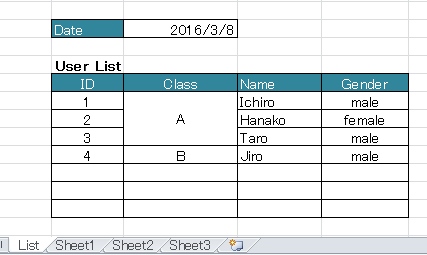

# XlsMapper

XlsMapper is Java Library for mapping Excel sheets to POJO.

* Licensee

Apache License verion 2.0

# Setup

```xml
<dependency>
	<groupId>com.github.mygreen</groupId>
	<artifactId>xlsmapper</artifactId>
	<version>1.2.1</version>
</dependency>
```

# Documentation
http://mygreen.github.io/xlsmapper/sphinx/howtouse.html

# Getting Started
For example, here is one Excel sheet.



Map this Excel sheet to POJO.
- Map the sheet with annotation ```@XlsSheet``` .
- Map the cell 'Date' with annotation ```@XlsLabelledCell``` .
- Map the table list 'User List' with annotation ```@XlsHorizontalRecords``` .

```java
// POJO for mapping sheet.
@XlsSheet(name="List")
public class UserSheet {

    @XlsLabelledCell(label="Date", type=LabelledCellType.Right)
    Date createDate;

    @XlsHorizontalRecords(tableLabel="User List")
    List<UserRecord> users;

}
```

And the following is the record class.
- Properties of the record class is mapped to columns by ```@XlsColumn``` .
- Can map to int and enum type. 

```java
// Record class
public class UserRecord {

    @XlsColumn(columnName="ID")
    int no;

    @XlsColumn(columnName="Class", merged=true)
    String className;

    @XlsColumn(columnName="Name")
    String name;

    @XlsColumn(columnName="Gender")
    Gender gender;

}

// enum for the gender.
public enum Gender {
    male, female;
}
```

You can get the mapped POJO using XlsMapper#load() like following:

```java
// Load sheet with mapping to POJO.
XlsMapper xlsMapper = new XlsMapper();
UserSheet sheet = xlsMapper.load(
    new FileInputStream("example.xls"), // excel sheet.
    UserSheet.class                     // POJO class.
    );
```

## How to saving the sheet.

For example with saving the sheet, using same sheet.

Here is the template Excel sheet.


And the following is the record class. 
- Append the annotation ```@XlsDateConverter``` for setting Excel format pattern.
- Append the attribute ```overRecord``` with ```@XlsHorizontalRecords```.

```java
@XlsSheet(name="List")
public class UserSheet {

    @XlsLabelledCell(label="Date", type=LabelledCellType.Right)
    @XlsDateConverter(excelPattern="yyyy/mm/dd")
    Date createDate;

    @XlsHorizontalRecords(tableLabel="User List", orverRecord=OverRecordOperate.Insert)
    List<UserRecord> users;

}
```

You can save the Excel with POJO using XlsMapper#save() like following:

```java
// Create sheet data.
UserSheet sheet = new UserSheet();
sheet.date = new Date();

List<UserRecord> users = new ArrayList<>();

// Create record data.
UserRecord record1 = new UserRecord();
record1.no = 1;
record1.className = "A";
record1.name = "Taro";
recrod1.gender = Gender.male;
users.add(record1);

UserRecord record2 = new UserRecord();
// ...
users.add(record2);

sheet.users = users;

// Save the Excel sheet.
XlsMapper xlsMapper = new XlsMapper();
xlsMapper.save(
    new FileInputStream("template.xls"), // for template excel file.
    new FileOutputStream("out.xls"),     // for output excel file.
    sheet                                // for created sheet data.
    );
```
 


